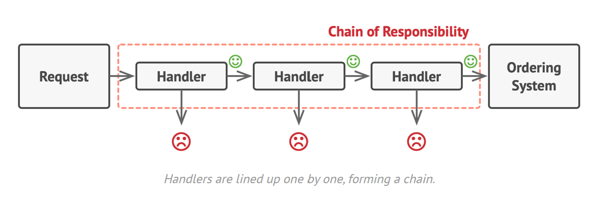
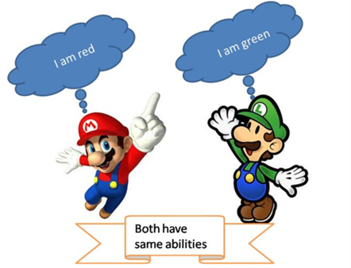
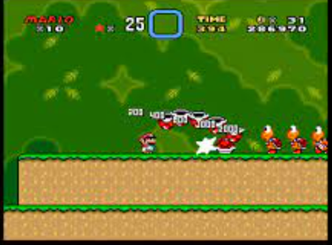
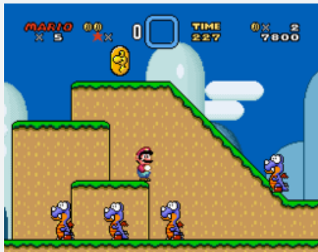

# Verhaltensmuster Chain of Responsibility

## Problem:
Ein mit der Zeit gewachsenes Programm beinhaltet mittlerweile viele unterschiedliche Checks - ohne jegliche Struktur. Manche Checks wiederholen sich sogar an verschiedenen Programmstellen. Sie prüfen zwar für unterschiedliche Programmabläufe, der Check an sich ist aber der gleiche.

Das **„Chain of Responsibility“ Entwurfsmuster** gibt vor, die einzelnen Checks als sogenannte „Handler“ zu implementieren. Die Handler können hintereinander geschaltet werden. Besteht die Anfrage den ersten Check wird sie zum zweiten Check weitergegeben usw.. Besteht die Anfrage den Check nicht, wird sie abgelehnt und nicht weitergereicht. Dadurch, dass die danach kommenden Handler nicht bemüht werden müssen, erspart man sich Ressourcen.

 
Erst wenn alle Handler bestanden wurden, kommt die Anfrage zu ihrem eigentlichen Ziel. Ein weiterer Vorteil ist, dass man einen bestimmten Handler an verschiedenen Programmstellen aufrufen kann und somit nicht Code kopieren muss.

Man kann das Design Pattern aber auch andersherum verwenden, und zwar, dass jeder einzelne Handler gefragt wird, ob er mit dem Request etwas machen kann und letztendlich nur der Handler, für den die Anfrage bestimmt ist, diese auch bearbeitet.

# Strukturmuster Flyweight (aka Cache)

## Problem:
Programme, welche zur Laufzeit viel Speicher benötigen, weil sie sehr viele ähnliche Objekte erzeugen, crashen auf Rechnern mit wenig RAM sehr viel schneller als auf leistungsstarken Programmierer-Notebooks. Das gleiche Problem kann auch entstehen, wenn im live-Betrieb plötzlich mehrere tausende Objekte erstellt werden, anstatt wie im Testszenario nur ein paar Hundert.

Hat man Speicherprobleme mit einem Programm, welches viele gleiche Objekte erstellt, kann das Design Pattern „Flyweight“ dazu beitragen, den Hauptspeicher ressourcenschonender zu verwenden.

## Beispiel:
Gleiche Objekte mit gleichen Eigenschaften anhand Super Mario World:
 

Koopas sind gleiche Objekte, evtl. ist mal die Farbe anders:
 

Dinosaurier sind gleiche Objekte:

 
Im Spiel gibt es tausende Münzen, Fische und Feuerbälle. Speichert man die gleichbleibenden Eigenschaften dieser Objekte in ein separates Objekt, kann man viel Speicherplatz sparen, da nur die veränderbaren Eigenschaften wiederholend Speicherplatz verbrauchen.

Umgesetzt wird das im Code durch 3 Klassen. In einer Klasse werden die gleichbleibenden Eigenschaften eines Objekts abgebildet (Flyweight), in der zweiten Klasse werden die veränderbaren Eigenschaften des Objekts abgebildet (Context). Die dritte Klasse verarbeitet neue Anfragen und liefert – wenn verfügbar - entweder bereits vorhandene Instanzen zurück oder erstellt eine Neue und gibt diese zurück.

# Design Pattern 3
## Problem:

Text