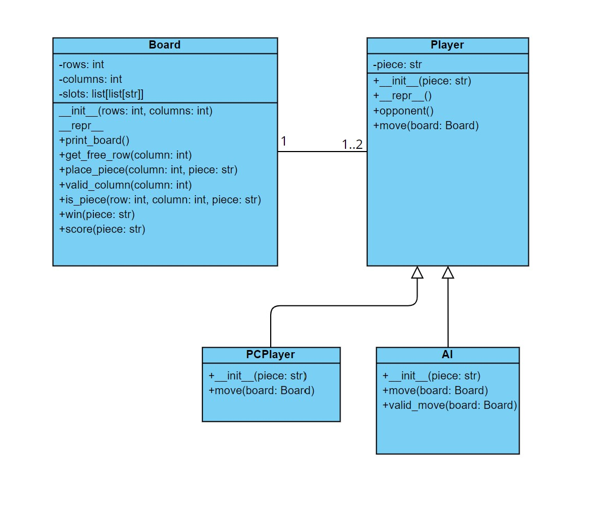

Sofware Name: VierGewinnt  
Version: 1.1  
Datum: 10.02.2023

# Software Zusammenfassung
# Spielanleitung
Das Spiel wird von zwei Spielern gespielt, und das Ziel ist es, vier Steine in eine vertikale, waagerechte oder diagonale Linie zu platzieren. Die Spieler sind abwechselnd an der Reihe und fügen jeweils einen Stein auf dem Spielfeld hinzu. Da das Spielbrett vertikal steht, kann ein Stein nicht an einer beliebigen Position auf dem Brett platziert werden. Ein Stein muss am oberen Ende einer der Spalten eingefügt werden, und er fällt so weit nach unten, bis er auf den bereits vorhandenen Steinen in dieser Spalte liegt oder bis er die unterste Reihe der Spalte erreicht. Die Standardgröße des Spielbretts für VierGewinnt ist sechs Reihen mal sieben Spalten.
# Anforderungen
Folgende Aspekte müssen umgesetzt werden:
- Das Spiel folgt den üblichen Regeln: Spielbrettgröße (6 Reihen und 7 Spalten) und vier horizontale, vertikale oder diagonale Steine in einer Farbe führen zu Spielgewinn.
- Nach Spielstart kann man sich entscheiden ob zwei Menschen spielen oder ob man gegen den Computer spielen möchte.
- Nach jedem Spielzug:
  - Es wird überprüft ob Spiel gewonnen wurde -> Sieger*in ausgeben und Spiel beenden o Spielbrett anzeigen 
  - Nächste*r Spieler*in kann Stein spielen oder Spiel beenden
- Der Computergegner muss nicht intelligent sein, sondern nur gültige Spielzüge durchführen.

# Beschreibung
**Klassen:** 
- Klasse Board
- Klasse Player  

  - PC-Player
  - AI

Um das Spielbrett darzustellen wurde die Klasse Board implementiert.  
Um einen Spieler darzustellen wurde die Klasse Player erstellt, von welcher die Unterklasse PC-Player abgeleitet ist.  
*Klassendiagramm siehe Bild:*  

*Beschreibung der Methoden--> siehe Docstrings*

Wir sind sehr nahe an unserer ursprünglicher Planung geblieben, haben jedoch noch eine Zusatzfunktion eingebaut *(Klasse AI)*, welche einen schlaueren Gegner simuliert. Dadurch haben sich zusätzliche Methoden für *Klasse Board* ergeben. 
